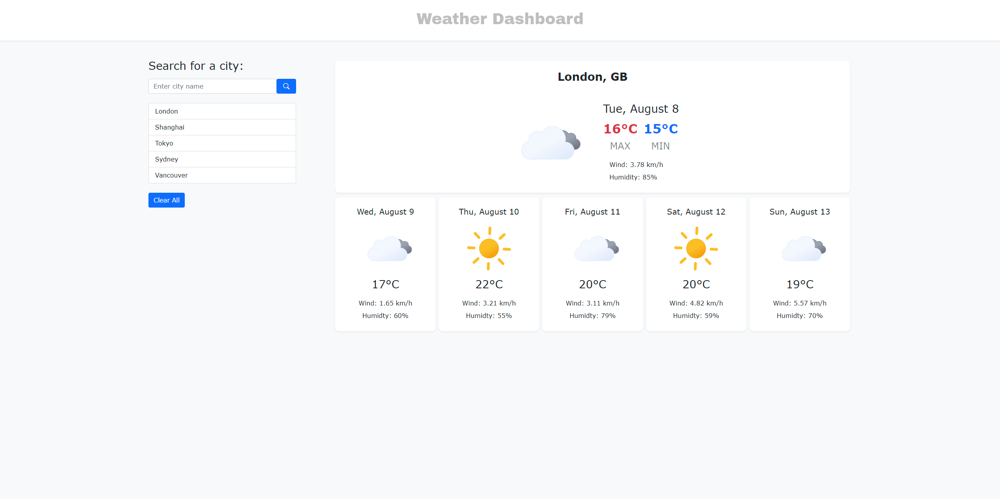

# w6-weather-dashboard

## Description

This is a simple weather application which displays a 6-day weather forecast for a searched city. 

## Installation

N/A

## Usage

Access the webpage using the deployed link [HERE](https://trahy.github.io/w6-weather-dashboard/).

When a city is searched, the current and future weather conditions for the searched city will be presented to the user.

When viewing the weather dashboard, the following information is shown:
- City Name and Country
- Date
- Weather Icon
- Temperature
- Wind Speed
- Humidity

When a city is searched, the weather conditions will be saved under the city name under the search bar.

When the city in the search history is clicked, the curent and future weather conditions for the saved city will be presented to the user again.

When the user clicks on the `Clear All` button, then the search history will be erased.

## Screenshot

## Credits

Special thanks to [basmilius](https://github.com/basmilius/weather-icons) for providing the free animated weather icons.

This application is powered by [OpenWeather](https://openweathermap.org/).

## License

Please refer to the LICENSE in the repo.

---
